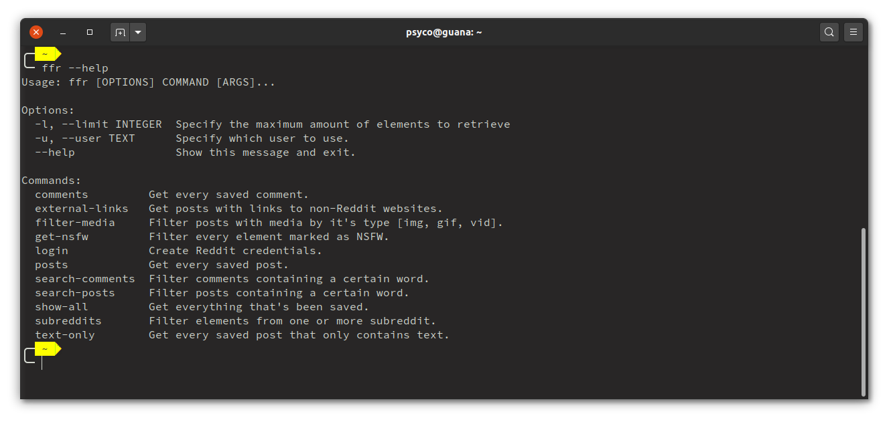
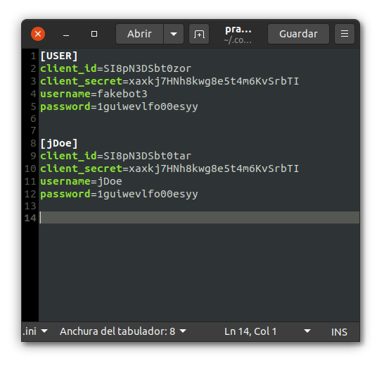

<center>
<h1 align="center">Filter for Reddit</h1>

<h4 align="center">Easily filter your saved reddit posts and commments</h4>
  <sub>Made with ❤ and tears by
  <a href="https://www.reddit.com/user/Psicoguana">Psicoguana</a>
  </sub>
  <br>
  <br>
    <a href="https://badge.fury.io/py/ffr"></a>
    <a href="https://wakatime.com/badge/github/Psycoguana/Filter-for-Reddit"></a>

</center>

<br>

# 💬 About:


Did you ever searched for random post or comment you saved in Reddit months ago? Maybe it belonged to a certain subreddit, was it NSFW? It definitely linked to some weird page no one heard of before...


What a hassle, besides having to pay attention to each and every post you saved, you have to scroll and do several Ctrl+F.

I hated that, so I created **Filter for Reddit** or `ffr` for short.


# ✨ Features:

* Get every saved element (post or comment).
* Get every post.
* Get every comment.
* Get posts with text only.
* Get posts with some type of media (image, gif or video).
* Filter specific subreddits.
* Search for a word in a saved post's title.
* Search for a word in a saved comment's body.
* Get every element marked as NSFW.
* Get posts with a link to an external website.
* Clickable links.
* Script for easy login.
* Multiple accounts support (Not currently supported by the menu).
* Specify maximum amount of elements to retrieve (Not currently supported by the menu).


# 📦 Install:
You can easily install `ffr` with pip:
```
pip3 install ffr
```

# 🔧 Setup:
First you'll need to login. Reddit requires that you create a _client_id_ and a _client_secret_. For that I borrowed and edited a [script from Praw](https://praw.readthedocs.io/en/latest/tutorials/refresh_token.html#refresh-token).

There are two way of doing this, you can either create the file manually or you can use the login command.

If you run `ffr login`, it will print something like this:


Follow the steps and it'll create a praw.ini file for you with the data that you entered, which will be used by the script. It will look something like this:


If you need to edit the file or want to create it manually, it's location will  be printed by the login command. If you missed it, this text grabbed from the [Praw Docs](https://praw.readthedocs.io/en/v3.6.2/pages/configuration_files.html#config-file-locations), should be helpul:

Assuming typical operating system installations and the username foobar the path for specific operating systems should be:

* **WINDOWS XP:** C:\Documents and Settings\foobar\Application Data\praw.ini
* **WINDOWS Vista / 7:** C:\Users\foobar\AppData\Roaming\praw.ini
* **OS with XDG_CONFIG_HOME defined:** $XDG_CONFIG_HOME/praw.ini
* **OS X / Linux:** /home/foobar/.config/praw.ini


⚠️ _**BE VERY CAREFUL WITH THIS FILE, IT CONTAINS ALL YOUR REDDIT ACCOUNT'S INFO.**_ ⚠️


&nbsp;


# 🖥️ Usage:

You can either use it's (under development) menu by calling `ffr`:


Or you can also run one of the many command available. To see them just run `ffr --help`:



### There are a 4 options that require one or more arguments:
#### 1. Get posts with some type of media:
You must specify the type of media you want. 

For example: `ffr filter-media img` will get you every posts that links to an image. You can choose `img`, `gif` or `vid`. For example, in my case `ffr filter-media img` returns:


#### 2. Filter specific subreddits:
You must specify one or more subreddits.

If you want to get your saved posts and comments belonging to one or more subreddits, let's say r/Python and r/Programming it's as easy as running `ffr subreddits hmm python`. 


Please note that if you want to search from the menu and not the command line, you must separate each subreddit with a comma.


#### 3. Search Post:
You must specify a word to look in the post's title.

This command takes a query argument which tells the script what you want to search in a comment's body. For example, in my case `ffr search-posts python` returns:


#### 4. Search Comments:
You must specify a word to look in the comment's body.

It works pretty much the same as the search for posts. `ffr search-comments python`.


# ➖➖ Optional arguments:
## There are two of these:

* `--user, -u` -> **Specify which user you want to use.** If you have more than one user in your praw.ini file like here:

 

You'll have to specify it's name when running the script, if you want to search every post and comment from the user _jDoe_, you must run: `ffr --user=jDoe show-all` or `ffr -u jDoe show-all`

* `--limit, -l` -> **Specify how many elements to retrieve.** By default, the script retrieves 100 elements, but if you feel like that's too much or too little just use this flag. For example:
 `ffr --limit=500 show-all` or `ffr -l 500 show-all`

 # 🔥 Compatibility:
 * **Linux:** Tested on Ubuntu 20.04.
 * **Windows:** Tested on Windows 10. The console doesn't support text with embedded hyperlinks, so it'll just print a third row with the links.
 * **Mac:** It should work too, but I don't have a Mac to test it. If you try it, please let me know how it went 🙂


# 🧩 Dependencies:

* [**Praw**](https://github.com/praw-dev/praw): to handle Reddit's API.
* [**Rich**](https://github.com/willmcgugan/rich): to easily create a beautiful table.
* [**click**](https://github.com/pallets/click): to easily create the CLI.


# 🔖 TODO:
- [x] ~~Create a Pypi package.~~
- [ ] Create an exe package.
- [ ] Support changing table colors.
- [ ] Improve login script format.
- [ ] Improve menu format.
- [ ] You tell me...


# 🗣️ Let me know!
What you think about **Filter for Reddit**? Feel free to send me a [DM on Reddit!](https://www.reddit.com/message/compose/?to=Psicoguana) ✉️

 Do you have any question or suggestion? Did you encounter any issue or found any bug? Feel free to open an issue and I'll check it ASAP 😉


# 📃 License:
[Mozilla Public License Version 2.0](LICENSE).