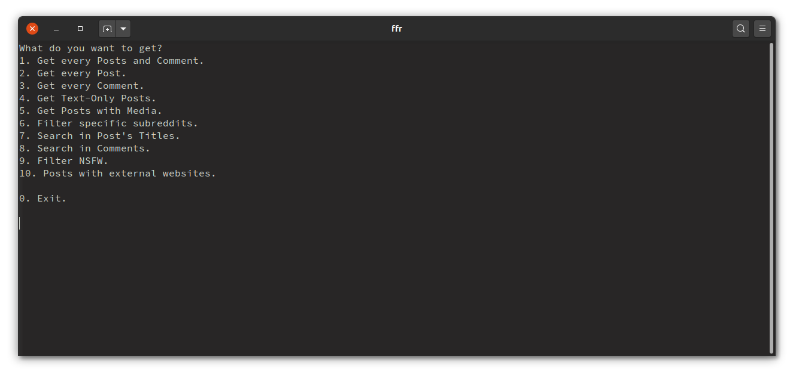

# **Filter for Reddit**

Did you ever felt like looking for a post or comment you saved in Reddit months ago?
If you did, I'm sure you had to Ctrl+F a lot.

I hated that, so I created **Filter for Reddit**

# Requirements:
This project has 2 dependencies:
    
* [**Praw**](https://github.com/praw-dev/praw): to handle Reddit's API.
* [**Rich**](https://github.com/willmcgugan/rich): to easily create a beautiful table.

To install with `pip` just run:


```
pip3 install -r requirements.txt
```

# Features:

* Get every saved element (post or comment).
* Get every post.
* Get every comment.
* Get posts with text only.
* Get posts with some type of media (image, gif or video).
* Filter specific subreddits.
* Search for a word in a saved post's title.
* Search for a word in a saved comment's body.
* Get every element marked as NSFW.
* Get posts with a link to an external website.
* Clickable links.
* Multiple accounts support (Not currently supported by the menu).
* Specify maximum amount of elements to retrieve (Not currently supported by the menu).


# Setup:
First you'll need to login. Reddit requires that you create a _client_id_ and a _client_secret_. For that I borrowed and edited a [script from Praw](https://praw.readthedocs.io/en/latest/tutorials/refresh_token.html#refresh-token).

You'll  have to call login.py, which will print this:


Follow the steps and it'll create a praw.ini file for you with the data you entered, which we'll be used by the script. 


BE VERY CAREFUL WITH THIS FILE, IT CONTAINS ALL YOUR REDDIT ACCOUNT'S INFO.


&nbsp;


# Usage

You can either use it's (under development) menu by calling `python3.8 ffr.py`:


Or you can also run one of the many command available. To see them just run `python3.8 ffr.py --help`:


### There are a 4 options that require one or more arguments:
#### 1. Get posts with some type of media:
You must specify the type of media you want. 

For example: `python3.8 ffr.py filter-media img` will get you every posts that links to an image. You can choose `img`, `gif` or `vid`. For example, in my case `python3.8 ffr.py filter-media img` returns:


#### 2. Filter specific subreddits:
You must specify one or more subreddits.

If you want to get your saved posts and comments belonging to one or more subreddits, let's say r/Python and r/Programming it's as easy as running `python3.8 ffr.py subreddits python programming`. 


Please note that if you want to search from the menu and not the command line, you must separate each subreddit with a comma.


#### 3. Search Post:
You must specify a word to look in the post's title.

This command takes a query argument which tells the script what you want to search in a comment's body. For example, in my case `python3.8 ffr.py search-post python` returns:


#### 4. Search Comments:
You must specify a word to look in the comment's body.

It works pretty much the same as the search for posts. `python3.8 ffr.py search-post python`.


# Optional arguments
## There are two of these:

* `--user, -u` -> Specify which user you want to use. If you have more than one user in your praw.ini file like here:
 

    You'll have to specify it's name when running the script, if I want to search every post and comment from the user _jDoe_, I'll run: `python3.8 --user=jDoe show-all` or `python3.8 -u jDoe show-all`

* `--limit, -l` -> Specify how many elements to retrieve. By default, the script retrieves 100 elements, but if you feel like that's too much or too little just use this flag. For example:
 `python3.8 --limit=500 show-all` or `python3.8 -l 500 show-all`

 # Compatibility:
 * **Linux:** Tested on Ubuntu 20.04.
 * **Windows:** Tested on Windows 10. The console doesn't support text with embedded hyperlinks, so it'll just print a third row with the links.
 * **Mac:** It should work too, but I don't have a Mac to test it :_

# TODO:
- [ ] Create a Pypi package.
- [ ] Support changing table colors.
- [ ] Improve login script format.
- [ ] Improve menu format.
- [ ] You tell me...